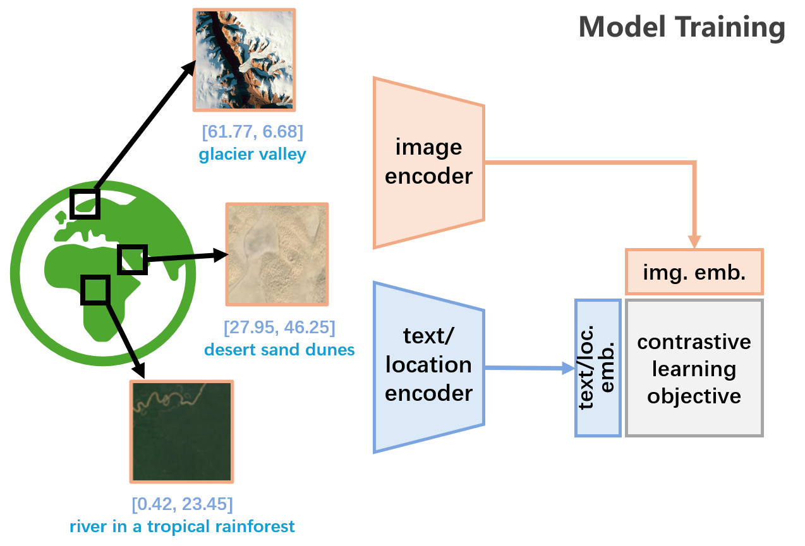
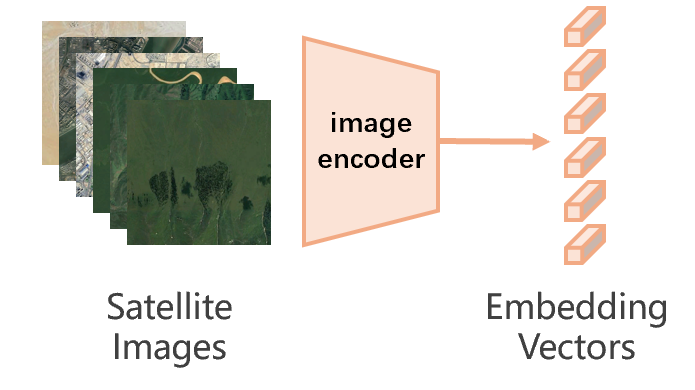
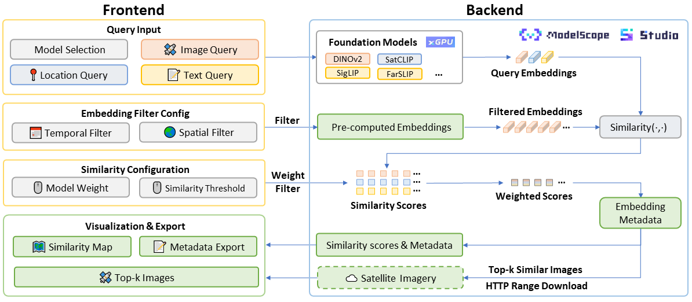
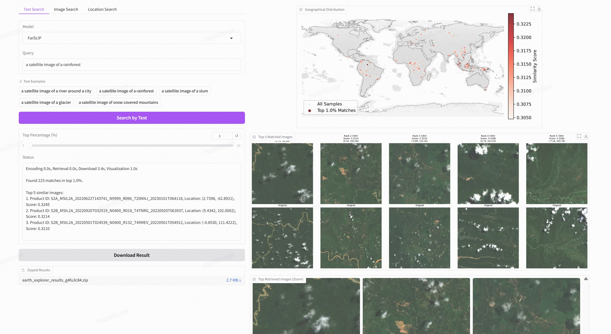
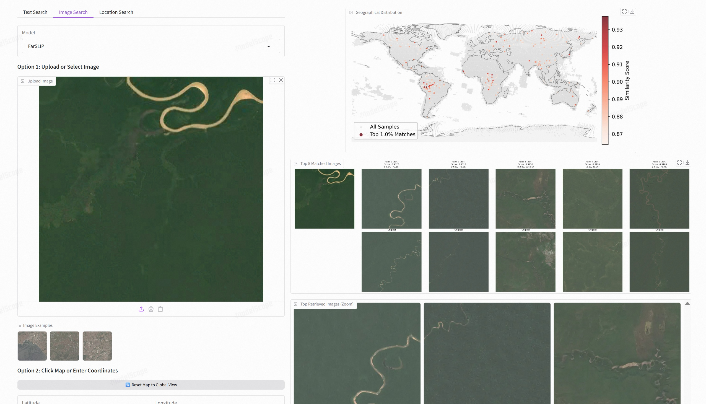
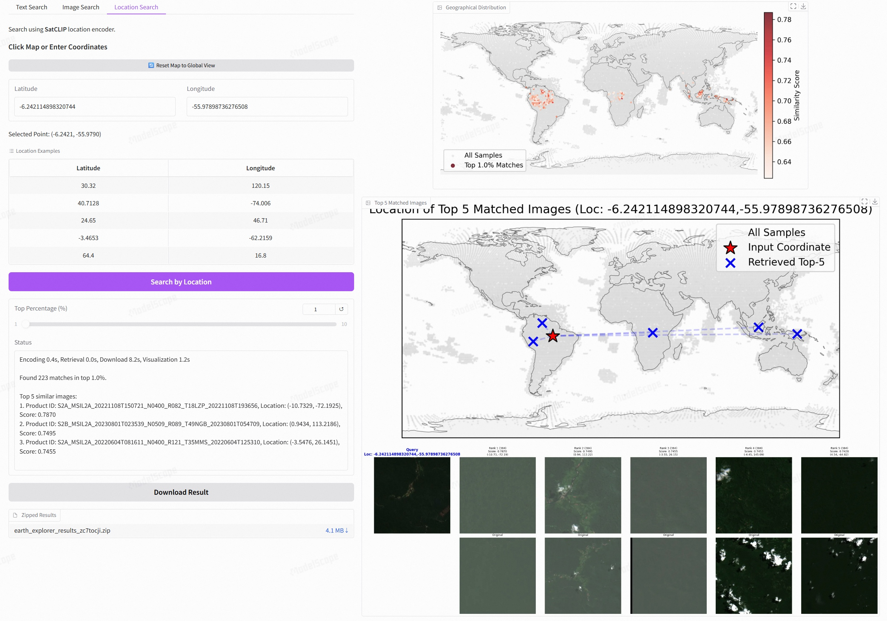

# EarthEmbeddingExplorer

<div align="center">
  <a href="https://modelscope.cn/studios/Major-TOM/EarthEmbeddingExplorer/"></a>
  <a href="https://modelscope.ai/studios/Major-TOM/EarthEmbeddingExplorer/"></a>
  <a href="https://modelscope.cn/collections/Major-TOM/Core-S2L2A-249k"></a>
  <a href="https://huggingface.co/datasets/ML4RS-Anonymous/EarthEmbeddings"></a>
  <a href="https://github.com/OpenGeoScope/EarthEmbeddingExplorer">  </a>
  <a href="https://arxiv.org/abs/2603.29441">  </a>
  <a href="https://openreview.net/forum?id=LSsEenJVqD">  </a>
</div>

EarthEmbeddingExplorer is an interactive web application for **cross-modal retrieval of global satellite imagery**. It allows you to search the Earth using **natural language**, **images**, or **geographic coordinates** — no need to download terabytes of data or write a single line of code.

Whether you are an AI researcher exploring vision-language models, a remote-sensing scientist looking for specific land-cover patterns, or simply curious about what satellite imagery can reveal, this tool is designed to be accessible and informative for everyone.

---

## Table of Contents

- [EarthEmbeddingExplorer](#earthembeddingexplorer)
  - [Table of Contents](#table-of-contents)
  - [Overview](#overview)
  - [How It Works](#how-it-works)
    - [Satellite Imagery Dataset](#satellite-imagery-dataset)
    - [Embedding Models](#embedding-models)
    - [System Architecture](#system-architecture)
  - [Datasets \& Pre-computed Embeddings](#datasets--pre-computed-embeddings)
    - [Source Imagery](#source-imagery)
    - [Pre-computed Embedding Datasets](#pre-computed-embedding-datasets)
  - [Quick Start](#quick-start)
    - [Use on ModelScope Studio](#use-on-modelscope-studio)
    - [Local Deployment](#local-deployment)
  - [Examples](#examples)
    - [Text Search](#text-search)
    - [Image Search](#image-search)
    - [Location Search](#location-search)
  - [Insights from Cross-Modal Retrieval](#insights-from-cross-modal-retrieval)
  - [Roadmap](#roadmap)
  - [Acknowledgements](#acknowledgements)
  - [Citation](#citation)
  - [References](#references)

---

## Overview

Imagine being able to type *"a satellite image of a glacier"* or *"a city with a coastline"* and instantly see matching locations on a world map, together with the actual satellite imagery. That is what EarthEmbeddingExplorer does.

Under the hood, the application encodes your query and ~249k satellite images into **embedding vectors** — compact numerical representations that capture semantic meaning. By measuring vector similarity, the system finds the most relevant images across the globe and visualizes them interactively.

**Key features:**
- 🔍 **Text-to-Image Retrieval** — Search satellite imagery with free-form natural language.
- 🖼️ **Image-to-Image Retrieval** — Upload a photo and find visually similar locations on Earth.
- 📍 **Location-to-Image Retrieval** — Input GPS coordinates or click on a map to discover what a specific place looks like from space.
- ⚡ **Near Real-Time Search** — Pre-computed embeddings and on-demand HTTP Range requests make retrieval fast without downloading the full dataset.
- 🌍 **Global Coverage** — Based on the [MajorTOM](https://github.com/ESA-PhiLab/MajorTOM) dataset, covering the Earth's land surface with Sentinel-2 imagery.

---

## How It Works

### Satellite Imagery Dataset

We use **[MajorTOM](https://github.com/ESA-PhiLab/MajorTOM)** (Major TOM: Expandable Datasets for Earth Observation), a large-scale dataset released by the European Space Agency (ESA). Specifically, we work with the [**Core-S2L2A-249k**](https://modelscope.cn/organization/Major-TOM?tab=collection) subset, which provides global Sentinel-2 Level-2A multispectral imagery at 10 m ground resolution.

| Dataset | Source | Samples | Sensor |
| :--- | :--- | :--- | :--- |
| MajorTOM-Core-S2L2A | Sentinel-2 L2A | 2,245,886 | Multispectral (10 m) |

Because the original tiles are large (1068 × 1068 pixels) and the full dataset exceeds 23 TB, we create a lightweight, search-friendly version:

1. **Center Cropping** — From each tile we extract the central 384 × 384 patch, which matches the input size expected by modern vision transformers.
2. **Uniform Sampling** — Using MajorTOM's hierarchical grid coding system, we sample roughly **1%** of the data (~249k images). This preserves global geographic coverage while keeping the embedding index small enough for interactive search.

<div align="center">
  
  <br>
  <em>Geographic distribution of our sampled satellite-image embeddings.</em>
</div>

### Embedding Models

The retrieval engine is powered by six complementary embedding models. Think of them as different "encoders" that map images, text, or coordinates into a shared latent space. If you are coming from remote sensing, think of them as feature extractors that turn raw pixels (and optional metadata) into comparable signatures.


**The six models we use:**

| Model | Modality | Training Data | Best For |
| :--- | :--- | :--- | :--- |
| **SigLIP** [3] | image + text | Natural image–text pairs (web) | General open-vocabulary text queries |
| **FarSLIP** [4] | image + text | Satellite image–text pairs (RS-specific) | Fine-grained remote-sensing concepts |
| **SatCLIP** [5] | image + location | Satellite image–GPS coordinate pairs | Location-aware retrieval |
| **DINOv2** [7] | image only | Natural images (self-supervised) | Pure visual similarity search |
| **Clay** [9] | image only | Multi-sensor EO (MAE self-supervised) | Multi-spectral Earth observation features |
| **OlmoEarth** [10] | image only | Sentinel-2 L2A + 6 derived maps (self-supervised) | Pure visual similarity with spectral awareness |

- **SigLIP** improves upon CLIP with a sigmoid loss and works well for everyday vocabulary.
- **FarSLIP** is fine-tuned on remote-sensing captions, making it better at concepts like *"deforestation"* or *"salt evaporation ponds"*.
- **SatCLIP** jointly encodes images and their geographic coordinates, enabling queries like *"show me places near (lat, lon)"*.
- **DINOv2** learns powerful visual features without any text supervision; it excels at *"find me images that look like this one"*.
- **Clay** is a foundation model trained on multi-spectral Earth observation data using a masked autoencoder. It captures rich geospatial features across 10 Sentinel-2 bands, making it ideal for pure visual similarity search in the remote-sensing domain.
- **OlmoEarth** is an Earth-system foundation model trained on Sentinel-2 and derived geospatial maps. It uses a flexible multi-modal architecture and excels at capturing spectral and spatial patterns from 12-band multispectral imagery.

Models such as **CLIP** [2] learn to align images and text by training on massive pairs of (image, caption) data from the web. An *image encoder* compresses a photo into a vector; a *text encoder* does the same for a sentence. The key property is that semantically matching pairs end up close together in vector space, while unrelated pairs are far apart.

<div align="center">
  
  <br>
  <em>How contrastive learning connect images and texts/locations in a shared embedding space.</em>
</div>

<div align="center">
  
  <br>
  <em>Turning satellite images into embedding vectors for fast similarity search.</em>
</div>

**Search pipeline:**
1. We pre-compute embeddings for all ~249k sampled satellite images using each of the six models.
2. When you submit a query (text, image, or coordinates), the app encodes it with the corresponding model's encoder.
3. Cosine similarity scores are computed against the entire image index.
4. High-scoring locations are plotted on an interactive map, and the top-5 most similar images are fetched on demand.

### System Architecture

<div align="center">
  
  <br>
  <em>EarthEmbeddingExplorer system architecture on ModelScope.</em>
</div>

The application is designed for cloud-native deployment on [ModelScope](https://www.modelscope.cn/):

- **Models & embeddings** are hosted on ModelScope (or Hugging Face) and downloaded on first use.
- **Raw imagery** stays in remote Parquet shards. Each row of the embedding dataset contains the fields `parquet_url` and `parquet_row`, so once an embedding is retrieved, the system immediately knows which remote Parquet shard and which row contain the corresponding raw image—no extra index lookup is needed.
- **On-demand fetching** uses HTTP Range requests to download only the necessary byte ranges (target row groups and the thumbnail column) from a Parquet file. This avoids downloading the full 23 TB dataset and enables near real-time image display.
- **GPU acceleration** is provided by [xGPU](https://www.modelscope.cn/brand/view/xGPU), allowing flexible allocation of GPU resources for encoding queries.

---

## Datasets & Pre-computed Embeddings

### Source Imagery

| Dataset | Link | Description |
| :--- | :--- | :--- |
| Core-S2L2A-249k | [ModelScope](https://modelscope.cn/datasets/Major-TOM/Core-S2L2A-249k) | Sampled subset of MajorTOM Core-S2L2A used in this project |

### Pre-computed Embedding Datasets

Each embedding dataset contains the vector representation of every sampled image, together with metadata (`grid_cell`, `parquet_url`, `parquet_row`) needed to retrieve the original pixels on demand.

| Model | Embedding Dataset | Link |
| :--- | :--- | :--- |
| SigLIP | Core-S2RGB-249k-SigLIP | [ModelScope](https://modelscope.cn/datasets/Major-TOM/Core-S2RGB-249k-SigLIP) |
| FarSLIP | Core-S2RGB-249k-FarSLIP | [ModelScope](https://modelscope.cn/datasets/Major-TOM/Core-S2RGB-249k-FarSLIP) |
| DINOv2 | Core-S2RGB-249k-DINOv2 | [ModelScope](https://modelscope.cn/datasets/Major-TOM/Core-S2RGB-249k-DINOv2) |
| SatCLIP | Core-S2RGB-249k-SatCLIP | [ModelScope](https://modelscope.cn/datasets/Major-TOM/Core-S2RGB-249k-SatCLIP) |
| Clay | Core-S2L2A-249k-Clay-v1.5 | [ModelScope](https://modelscope.cn/datasets/Major-TOM/Core-S2L2A-249k-Clay-v1.5) |
| OlmoEarth | Core-S2RGB-249k-OlmoEarth | [ModelScope](https://modelscope.cn/datasets/WeijieWu/olmoearth_embdding) |

> **Note for developers:** The `parquet_url` field stores a direct HuggingFace URL (e.g., `https://huggingface.co/datasets/Major-TOM/Core-S2L2A/resolve/main/images/part_00001.parquet`) and `parquet_row` stores the global row index, enabling online image download when the app is deployed on ModelScope or Hugging Face Spaces.

---

## Quick Start

### Use on ModelScope Studio

EarthEmbeddingExplorer is hosted live on [ModelScope Studio](https://modelscope.cn/studios/Major-TOM/EarthEmbeddingExplorer) ([modelscope.cn](https://modelscope.cn/studios/Major-TOM/EarthEmbeddingExplorer) for China, [modelscope.ai](https://modelscope.ai/studios/Major-TOM/EarthEmbeddingExplorer) for international users) and [Hugging Face Spaces](https://huggingface.co/spaces/ML4Sustain/EarthExplorer). We recommend ModelScope for the smoothest experience: it provides free GPU resources and optimized bandwidth for downloading imagery directly from the Parquet shards.

### Local Deployment

```bash
# 1. Clone the repository
git clone https://github.com/VoyagerX/EarthEmbeddingExplorer.git
cd EarthEmbeddingExplorer

# 2. Install dependencies
pip install -r requirements.txt

# 3. Launch the app
python app.py
```

> **Note on OlmoEarth compatibility:** `olmoearth-pretrain-minimal` requires `torch >= 2.8, < 2.9`. If your environment has an older PyTorch version, we strongly recommend creating a dedicated conda environment to avoid conflicts:
> ```bash
> conda create -n eee python=3.12
> conda activate eee
> conda install pytorch==2.8.0 torchvision==0.23.0 pytorch-cuda=12.4 -c pytorch -c nvidia
> pip install -r requirements.txt
> ```

By default the app downloads models and embeddings from ModelScope. You can switch the download endpoint via the environment variable:

```bash
export DOWNLOAD_ENDPOINT="modelscope.cn"  # China users (fastest domestic access)
# export DOWNLOAD_ENDPOINT="modelscope.ai"  # International users (ModelScope global)
# export DOWNLOAD_ENDPOINT="huggingface"    # International users (Hugging Face)
python app.py
```

> **Tip:** If you are in mainland China, use `modelscope.cn` for the fastest download speeds. International users should use `modelscope.ai` or `huggingface`.

---

## Examples

### Text Search
Type a natural-language description and see matching locations worldwide.

<div align="center">
  
  <br>
  <em>Query: "a satellite image of a glacier"</em>
</div>

### Image Search
Upload an image and retrieve geographically diverse locations that share visual similarity.

<div align="center">
  
  <br>
  <em>Query image → similar satellite locations in the Amazon region.</em>
</div>

### Location Search
Click on the map or enter GPS coordinates to discover what that place looks like from space.

<div align="center">
  
  <br>
  <em>Location query near the Amazon basin.</em>
</div>

---

## Insights from Cross-Modal Retrieval

EarthEmbeddingExplorer doubles as a **diagnostic tool** for embedding models.Comparing how different encoders respond to the same query quickly reveals domain gaps and geographic biases invisible to static benchmarks. For example:

- **Domain gap.** SigLIP, trained on everyday web images, often stumbles on geoscientific terms (e.g., *"glacier"*, *"salt evaporation ponds"*). FarSLIP closes this gap via RS-specific fine-tuning, yet then underperforms on generic non-RS queries—exposing a specialization–generality trade-off.

- **Geographic bias.** Side-by-side maps show uneven global priors. For *"snow covered mountains"*, FarSLIP concentrates on Asia’s high-elevation belts (Himalayas, Kunlun, Tianshan), while SigLIP favors the Andes and New Zealand’s Southern Alps. For *"glacier"*, FarSLIP retrieves polar and Antarctic regions, whereas SigLIP omits Antarctica—likely because polar imagery is absent from its pre-training corpus. Even well-specified prompts occasionally return mismatched patches (e.g., ocean tiles for land-cover concepts), pointing to limited geographic awareness in current embedding spaces.

For more details, please check our [tutorial paper on arXiv](https://arxiv.org/abs/2603.29441).

---

## Roadmap

- [ ] Integrate FAISS for faster approximate nearest-neighbor search.
- [ ] Support additional embedding models and datasets.
- [ ] Increase the coverage of embedding datasets.
- [ ] What features do you want? Leave an issue or start a discussion!

We warmly welcome new contributors. See [CONTRIBUTING.md](CONTRIBUTING.md) for guidelines on generating a new embedding dataset and submitting a pr.

---

## Acknowledgements

We thank the following open-source projects and datasets that made EarthEmbeddingExplorer possible:

**Models:**
- [SigLIP](https://huggingface.co/timm/ViT-SO400M-14-SigLIP-384) — Vision Transformer for image-text alignment
- [FarSLIP](https://github.com/NJU-LHRS/FarSLIP) — Fine-grained remote-sensing language-image pretraining
- [SatCLIP](https://github.com/microsoft/satclip) — Satellite location-image pretraining
- [DINOv2](https://huggingface.co/facebook/dinov2-large) — Self-supervised vision transformer
- [Clay](https://github.com/Clay-foundation/model) — Multi-spectral Earth observation foundation model
- [OlmoEarth](https://huggingface.co/allenai/OlmoEarth-Base-WS) — Earth-system foundation model for multimodal Earth observation

**Datasets:**
- [MajorTOM](https://github.com/ESA-PhiLab/MajorTOM) — Expandable datasets for Earth observation by ESA

We are grateful to the research communities and organizations that developed and shared these resources.

---

## Citation

If you use EarthEmbeddingExplorer in your research, please cite:

```bibtex
@inproceedings{
  zheng2026earthembeddingexplorer,
  title={EarthEmbeddingExplorer: A Web Application for Cross-Modal Retrieval of Global Satellite Images},
  author={Yijie Zheng and Weijie Wu and Bingyue Wu and Long Zhao and Guoqing Li and Mikolaj Czerkawski and Konstantin Klemmer},
  booktitle={4th ICLR Workshop on Machine Learning for Remote Sensing (Tutorial Track)},
  year={2026},
  url={https://openreview.net/forum?id=LSsEenJVqD}
}
```

---

## References

[1] Francis, A., & Czerkawski, M. (2024). Major TOM: Expandable Datasets for Earth Observation. *IGARSS 2024*.

[2] Radford, A., et al. (2021). Learning Transferable Visual Models From Natural Language Supervision. *ICML 2021*.

[3] Zhai, X., et al. (2023). Sigmoid Loss for Language-Image Pre-Training. *ICCV 2023*.

[4] Li, Z., et al. (2025). FarSLIP: Discovering Effective CLIP Adaptation for Fine-Grained Remote Sensing Understanding. *arXiv 2025*.

[5] Klemmer, K., et al. (2025). SatCLIP: Global, General-Purpose Location Embeddings with Satellite Imagery. *AAAI 2025*.

[6] Czerkawski, M., Kluczek, M., & Bojanowski, J. S. (2024). Global and Dense Embeddings of Earth: Major TOM Floating in the Latent Space. *arXiv preprint arXiv:2412.05600*.

[7] Oquab, M., et al. (2023). DINOv2: Learning Robust Visual Features without Supervision. *arXiv preprint arXiv:2304.07193*.

[8] Zheng, Y., et al. (2026). EarthEmbeddingExplorer: A Web Application for Cross-Modal Retrieval of Global Satellite Images. *4th ICLR Workshop on ML4RS (Tutorial Track)*.

[9] Development Seed. (2024). Clay: An Open Source AI Model and Interface for Earth. *https://github.com/Clay-foundation/model*.

[10] Herzog, H., et al. (2025). OlmoEarth: Stable Latent Image Modeling for Multimodal Earth Observation. *arXiv preprint arXiv:2511.13655*.
