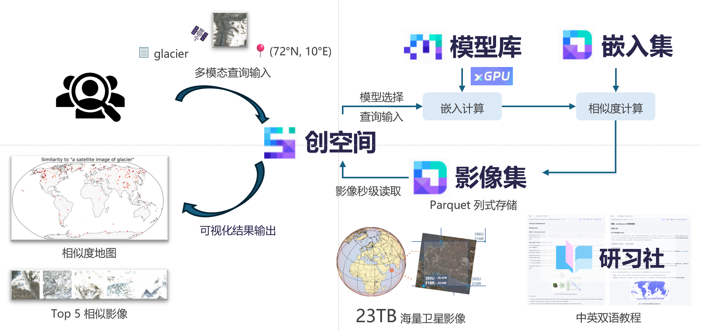

# EarthEmbeddingExplorer 地球探索者

<div style="display: flex; gap: 0.2em; align-items: center; justify-content: center;">
    <a href="https://modelscope.cn/studios/Major-TOM/EarthEmbeddingExplorer/"></a>
    <a href="https://modelscope.ai/studios/Major-TOM/EarthEmbeddingExplorer/"></a>
    <a href="https://modelscope.cn/datasets/VoyagerX/EarthEmbeddings"></a>
    <a href="https://huggingface.co/datasets/ML4RS-Anonymous/EarthEmbeddings/tree/main"></a>
    <a href="https://huggingface.co/spaces/ML4Sustain/EarthExplorer/blob/main/Tutorial.md">  </a>
    <a href="https://modelscope.cn/studios/VoyagerX/EarthExplorer/file/view/master/Tutorial_zh.md?status=1">  </a>
    <a href="https://openreview.net/forum?id=LSsEenJVqD">  </a>
</div>

## 背景介绍

### 这个项目是做什么的？
EarthExplorer 是一个可以通过**自然语言**，**图像**，或**地理位置**搜索卫星图像的工具。简单来说，你可以输入像“a satellite image of glacier”或“a satellite image of city with a coastline”这样的描述，系统就会在地球上找到符合你描述的地点，并将它们在地图上展示出来。EarthExplorer 可以让用户足不出户地，以多种方式探索地球上的每一个角落，在地理科学领域有广泛的应用价值。例如，地质学家们可以用这个工具来快速寻找冰川的分布；生物学家可以快速进行森林覆盖的制图，建筑学家们可以研究世界不同地区的城市发展结构。


## 它是如何工作的？（核心原理）

### 卫星影像数据集
我们使用了欧空局（ESA）发布的 **MajorTOM** (Major TOM: Expandable Datasets for Earth Observation) 数据集 [1]。具体来说，我们使用的是 [Core-S2L2A](https://modelscope.cn/datasets/Major-TOM/Core-S2L2A) 这个子集。

| 数据集 | 影像来源 | 嵌入数量 | 传感器类型 | 
| :--- | :--- | :--- | :--- | 
| MajorTOM-Core-S2L2A | Sentinel-2 Level 2A | 2,245,886 | 多光谱 |

MajorTOM Core-S2L2A 包含了全球覆盖的 Sentinel-2 多光谱影像（10m 分辨率）；我们将这个数据集则利用 SigLIP 模型将 RGB 波段处理成了嵌入。这为我们节省了大量时间，因为我们不需要自己去处理这些原始图像！此外，图像嵌入（一串数字）的存储空间远小于原始图像，计算效率也更高！

为了让 EarthExplorer 响应迅速，我们创建了一个更小、更有代表性的数据集版本。

Core-S2L2A 中的原始卫星图像尺寸很大（1068x1068 像素），但 AI 模型需要较小的输入尺寸（384x384 或 224x224 像素）。
1. **裁剪**：为了简化，对每个原尺寸图像，我们仅选取大图正中心的 384x384 或 224x224 像素区域所生成的嵌入。
2. **随机采样**：我们根据 MajorTOM 的网格编码系统，均匀采样了 **1%** 的数据（约 22000 张图像）。这样既能保证全球覆盖，又可以在很短的时间内检索出结果。

<div align="center">
  
  <br>
  <em>图 1：我们采样的卫星图像嵌入的地理分布。</em>
</div>

### 检索模型
图像检索核心技术包括 **CLIP (Contrastive Language-Image Pre-training)** [2] 和 **DINOv2 (自监督视觉Transformer)** [7]。我们使用的是 CLIP 的改进版本 **SigLIP (Sigmoid Language-Image Pre-training)** [3], **FarSLIP (Fine-grained Aligned Remote Sensing Language Image Pretraining)** [4], 和 **SatCLIP (Satellite Location-Image Pretraining)** [5]，以及用于纯视觉相似度搜索的 **DINOv2** [7]。

想象一下教小孩子识物。你给他们看一张冰川的照片，并说“冰川”。在看了很多冰川的照片并听到这个词后，孩子就学会了将冰川的样子和“冰川”这个词联系起来。

类 CLIP 模型的工作原理类似，但规模要大得多。
- 它使用图片编码器将**图像**转换成一种数学表示（一串数字），我们称之为**嵌入 (Embedding)**。
- 它也使用文本/地理位置编码器将**文本**或**地理位置（经纬度坐标）**转换成类似的数学表示（嵌入）。

神奇之处在于，如果一张图片和一段文字描述或经纬度是匹配的，它们转换后的数学表示就会非常接近。如果不匹配，它们就会相距很远。

<div align="center">
  
  <br>
  <em>图 2：CLIP 类模型如何连接图像和文本/位置。</em>
</div>

另一方面，DINOv2 是一种自监督视觉模型，无需配对的文本数据即可学习丰富的视觉表示。它擅长捕捉视觉模式，可用于图像到图像的相似度搜索。

我们用到的四个模型的模型结构和训练数据是：
| 模型 | 编码器类型 | 训练数据来源  |
| :--- | :--- | :--- | 
| SigLIP | 图像编码器+文本编码器 | 互联网上的自然图像-文本对 |
| DINOv2 | 仅图像编码器 | 互连网上的自然图像（自监督） |
| FarSLIP | 图像编码器+文本编码器 | 卫星图像-文本对 |
| SatCLIP | 图像编码器+位置编码器 | 卫星图像-地理位置对 |

<div align="center">
  
  <br>
  <em>图 3：将卫星图像转换成嵌入向量。</em>
</div>

在 EarthExplorer 中：
1. 我们将全球均匀采样的约25万张卫星图像，分别使用 SigLIP, DINOv2, FarSLIP, 和 SatCLIP 的图像编码器，将卫星图像已经转换成这种数学"嵌入"。
2. 当你输入一个查询，这个查询可以是文本（例如"a satellite image of glacier"），图像（一张冰川的图像），或地理位置(-89, 120)，我们将你的查询也使用对应的编码器转换成嵌入。
3. 然后，我们将你的查询嵌入与所有卫星图像的嵌入进行比较，将相似度在地图上可视化，并展示最相似的5张图像。


## 系统架构

<div align="center">
  
  <br>
  <em>图 4：基于魔搭创空间的 EarthExplorer 系统架构。</em>
</div>

我们基于魔搭平台进行部署：模型、嵌入数据集、以及原始影像数据集都托管在魔搭上。我们将 APP 部署在 [xGPU](https://www.modelscope.cn/brand/view/xGPU) 环境下，使得用户可以获得灵活调度的免费 GPU 资源，加快检索速度。

### 原始影像是如何存的？

MajorTOM Core-S2L2A 的原始影像体量很大（约 23TB），以 **Parquet 分片（shard）** 的方式存储：

- **分片存储**：数据被拆成很多个远端 Parquet 文件（分片），每个分片只包含一部分影像样本。
- **列式存储**：每个影像的不同字段/波段（例如 B04/B03/B02、thumbnail）存成不同的列，需要什么就读什么。
- **元数据索引**：我们额外维护一份很小的索引表，把 `product_id → (parquet_url, parquet_row)` 对应起来，告诉系统“这个 id 的影像在哪个分片、在分片里的哪个位置”。

这样，当用户只需要查看检索结果的少量影像时，系统可以通过 **HTTP Range 请求**只下载 Parquet 文件中“那一小段字节”（对应目标行/行组 + 指定列的数据），而不是下载整个 23TB 数据集，从而实现秒级取图。

### 当你使用这个 App 时

1. **输入查询**：你可以输入文字、上传图片、输入经纬度；也可以在地图上点击一个位置，直接把该点经纬度作为查询。
2. **计算相似度**：App 将你的查询编码成一个“嵌入向量”，并与嵌入数据集中每一张卫星图像的嵌入计算相似度分数。
3. **展示检索结果**：系统过滤掉相似度较低的结果，把相似度最高的地点（以及分数）显示在地图上；你可以用滑动条调整阈值。
4. **按需下载原图**：对最相似的前 5 张影像，系统用 `product_id` 查询元数据索引定位到远端 `parquet_url` 和行位置，然后通过 HTTP Range 只拉取对应缩略图数据，在前端快速展示原始影像。


## 示例
<div align="center">
  
  <br>
  <em>图 5：以文搜图示例。</em>
</div>
<br>

<div align="center">
  
  <br>
  <em>图 6：以图搜图示例。</em>
</div>

<br>
<div align="center">
  
  <br>
  <em>图 7：以点搜图示例。</em>
</div>
 

## 局限性

虽然 EarthExplorer 有很大的应用潜力，但它也有一些局限性。SigLIP 模型主要是通过互联网上的"自然图像"（如人物、猫狗、汽车、日常用品的照片）训练的，而不是专门针对卫星图像训练的。这种训练数据和应用时数据的偏差，使得模型可能难以理解特定的科学术语或在普通网络照片中不常见的独特地理特征。

而 FarSLIP 模型对非典型遥感地物的语言描述，例如 'an image of face' 的检索效果不佳。

## 致谢
我们感谢以下开源项目和数据集，它们使 EarthExplorer 得以实现：

**模型：**
- [SigLIP](https://huggingface.co/timm/ViT-SO400M-14-SigLIP-384) - 用于图像-文本对齐的视觉Transformer模型
- [FarSLIP](https://github.com/NJU-LHRS/FarSLIP) - 细粒度卫星图像-文本预训练模型
- [SatCLIP](https://github.com/microsoft/satclip) - 卫星位置-图像预训练模型
- [DINOv2](https://huggingface.co/facebook/dinov2-large) - 自监督视觉Transformer

**数据集：**
- [MajorTOM](https://github.com/ESA-PhiLab/MajorTOM) - 欧洲航天局（ESA）的可扩展地球观测数据集

我们感谢开发和分享这些资源的研究社区和组织。

## 贡献者
- [郑祎杰](https://voyagerxvoyagerx.github.io/)
- [伍炜杰](https://github.com/go-bananas-wwj)
- [吴冰玥](https://brynn-wu.github.io/Brynn-Wu)
- [Mikolaj Czerkawski](https://mikonvergence.github.io/)
- [Konstantin Klemmer](https://konstantinklemmer.github.io/)

## 路线图
- [x] 支持 DINOv2 嵌入模型和嵌入数据集。
- [ ] 将地理覆盖率（采样率）提高到地球陆地表面的 1.2%。
- [ ] 支持 FAISS 以实现更快的相似度搜索。
- [ ] 您想要哪些功能？请在[这里](https://huggingface.co/spaces/ML4Sustain/EarthExplorer/discussions)留言！

我们热烈欢迎新的贡献者！

## 引用
```bibtex
@inproceedings{
zheng2026earthembeddingexplorer,
title={EarthEmbeddingExplorer: A Web Application for Cross-Modal Retrieval of Global Satellite Images},
author={Yijie Zheng and Weijie Wu and Bingyue Wu and Long Zhao and Guoqing Li and Mikolaj Czerkawski and Konstantin Klemmer},
booktitle={4th ICLR Workshop on Machine Learning for Remote Sensing (Tutorial Track)},
year={2026},
url={https://openreview.net/forum?id=LSsEenJVqD}
}
```

## 引用
[1] Francis, A., & Czerkawski, M. (2024). Major TOM: Expandable Datasets for Earth Observation. IGARSS 2024.

[2] Radford, A., et al. (2021). Learning Transferable Visual Models From Natural Language Supervision. ICML 2021.

[3] Zhai, X., et al. (2023). Sigmoid Loss for Language-Image Pre-Training. ICCV 2023.

[4] Li, Z., et al. (2025). FarSLIP: Discovering Effective CLIP Adaptation for Fine-Grained Remote Sensing Understanding. arXiv 2025.

[5] Klemmer, K. et al. (2025). SatCLIP: Global, General-Purpose Location Embeddings with Satellite Imagery. AAAI 2025.

[6] Czerkawski, M., Kluczek, M., & Bojanowski, J. S. (2024). Global and Dense Embeddings of Earth: Major TOM Floating in the Latent Space. arXiv preprint arXiv:2412.05600.

[7] Oquab, M., et al. (2023). DINOv2: Learning Robust Visual Features without Supervision. arXiv preprint arXiv:2304.07193.

[8] Zheng, et al. (2026). EarthEmbeddingExplorer: A Web Application for Cross-Modal Retrieval of Global Satellite Images. 4th ICLR Workshop on ML4RS (Tutorial Track)
